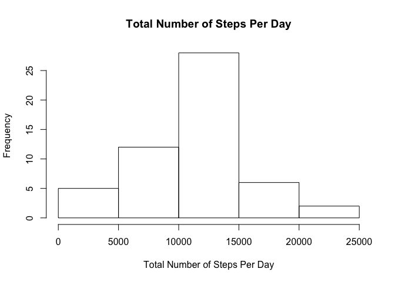
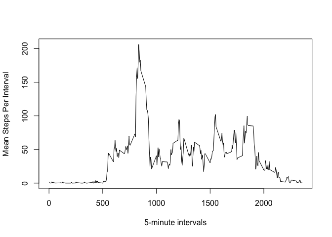
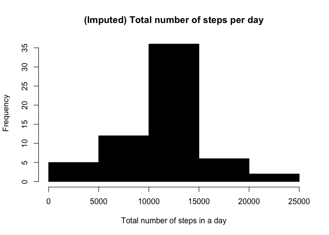
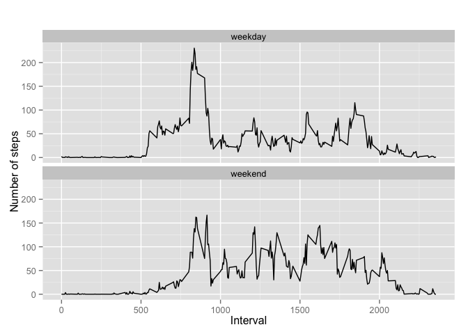

# Reproducible Research: Peer Assessment 1
Mindy Ng  
September 17, 2015  

#Make sure R/RStudio is in the working directory that has data named "activity.csv".
##Put data into variable for processing needs.
1. Load the data (i.e. read.csv())

```r
activity<-read.csv("activity.csv")
```
2. Process/transform the data (if necessary) into a format suitable for your analysis

##Load required packages for data transformation such as library(knitr) and library(dplyr).
## Remove NA's from dataset. And store this in variable called "activity".


```r
library(knitr)
library(dplyr)
```

```
## 
## Attaching package: 'dplyr'
## 
## The following objects are masked from 'package:stats':
## 
##     filter, lag
## 
## The following objects are masked from 'package:base':
## 
##     intersect, setdiff, setequal, union
```

```r
activity<-na.omit(activity)
```
What is mean total number of steps taken per day?
1. 
##Collect dates together.
##Take sum of each.
##Put this into var for future data transformation.

```r
StepsPerDay<-aggregate(steps~date, activity, sum)
```

2. Make a histogram of the total number of steps taken each day

```r
hist(StepsPerDay$steps, main="Total Number of Steps Per Day", xlab="Total Number of Steps Per Day")
```

 

3. Calculate and report the mean and median total number of steps taken per day.
#Store mean and median in variables for future data transformation.

```r
MeanStepsPerDay<-mean(StepsPerDay$steps)
MeanStepsPerDay
```

```
## [1] 10766.19
```

```r
MedianStepsPerDay<-median(StepsPerDay$steps)
MedianStepsPerDay
```

```
## [1] 10765
```
What is the average daily activity pattern?

1. Make a time series plot (i.e. type = "l") of the 5-minute interval (x-axis) and the average number of steps taken, averaged across all days (y-axis)


```r
MeanStepsPerInterval<-aggregate(steps~interval,activity,mean)

plot(MeanStepsPerInterval$steps~MeanStepsPerInterval$interval, type="l", ylab="Mean Steps Per Interval", xlab="5-minute intervals")
```

 
2. Which 5-minute interval, on average across all the days in the dataset, contains the maximum number of steps?
##Find max's row ID.
##According to row ID, determine number of steps. This is the 5-min interval that has max value of steps. 
##Ouput row ID's values corresponding to max point in graph.

```r
MaxID<-which.max(MeanStepsPerInterval$steps)
MeanStepsPerInterval[MaxID,]
```

```
##     interval    steps
## 104      835 206.1698
```
It turns out that row ID: 104 has the max value of 206.1698 steps at interval: 835.

Imputing missing values

Note that there are a number of days/intervals where there are missing values (coded as NA). The presence of missing days may introduce bias into some calculations or summaries of the data.

1. Calculate and report the total number of missing values in the dataset (i.e. the total number of rows with NAs)
##Retrive original data with NA's.
##Calculate how many rows with NA's.

```r
Originaldata<-read.csv("activity.csv")
sum(is.na(Originaldata))
```

```
## [1] 2304
```

2.  Devise a strategy for filling in all of the missing values in the dataset. The strategy does not need to be sophisticated. For example, you could use the mean/median for that day, or the mean for that 5-minute interval, etc.
##If steps are missing, use mean taken during that day's readings.
##If interval is missing, use mean of steps taken during that day's readings.
#Able to loop across dataset. If NA is detected, find correspoinding missing value and substitute it in. 
## This is how data set becomes "fuller"/less bias and more representaitve of whole population. 

3.Create a new dataset that is equal to the original dataset but with the missing data filled in.

```r
for (i in 1:nrow(Originaldata)){
   if (is.na(Originaldata$steps[i])){
     intervalVal <- Originaldata$interval[i]
     rowID <- which(MeanStepsPerInterval$interval == intervalVal)
     stepsVal <- MeanStepsPerInterval$steps[rowID]
     Originaldata$steps[i] <- stepsVal
}}

ImputedSteps<-aggregate(steps ~ date, Originaldata, sum)
```
Make a histogram of the total number of steps taken each day and Calculate and report the mean and median total number of steps taken per day. Do these values differ from the estimates from the first part of the assignment? What is the impact of imputing missing data on the estimates of the total daily number of steps?

```r
hist(ImputedSteps$steps, col=1, main="(Imputed) Total number of steps per day", xlab="Total number of steps in a day")
```

 

```r
mean(ImputedSteps$steps)
```

```
## [1] 10766.19
```

```r
median(ImputedSteps$steps)
```

```
## [1] 10766.19
```

```r
##Given that the non-imputed data was off by .19 for the mean and 1.19 for the median, the strategy for replacing NA's before processing data was not a bad alternative. Values between imputed and non-imputed did not differ by much. There was little impact in imputing missing data on the estimates of the total daily number of steps. 
```
Are there differences in activity patterns between weekdays and weekends?

For this part the weekdays() function may be of some help here. Use the dataset with the filled-in missing values for this part.

1. Create a new factor variable in the dataset with two levels -- "weekday" and "weekend" indicating whether a given date is a weekday or weekend day.


```r
# Convert dates from string to Date class.
Originaldata$date <- as.Date(Originaldata$date, "%Y-%m-%d")

# Add new column indicating day of the week. 
Originaldata$day <- weekdays(Originaldata$date)

# Add new column called day type and call it weekday.
Originaldata$day_type <- c("weekday")

# If either Saturday or Sunday, make day_type as weekend.
for (i in 1:nrow(Originaldata)){
  if (Originaldata$day[i] == "Saturday" || Originaldata$day[i] == "Sunday"){
      Originaldata$day_type[i] <- "weekend"}}
 
# Convert day_time from character to factor.
Originaldata$day_type <- as.factor(Originaldata$day_type)

 
# Aggregate steps as interval to get average number of steps in an interval across all days.
table_interval_steps_imputed <- aggregate(steps ~ interval+day_type, Originaldata, mean)


##2. Make a panel plot containing a time series plot (i.e. type = "l") of the 5-minute interval (x-axis) and the average number of steps taken, averaged across all weekday days or weekend days (y-axis).

# Make the panel plot for weekdays and weekends.
library(ggplot2)

qplot(interval, steps, data=table_interval_steps_imputed, geom=c("line"), xlab="Interval", 
      ylab="Number of steps", main="") + facet_wrap(~ day_type, ncol=1)
```

 
